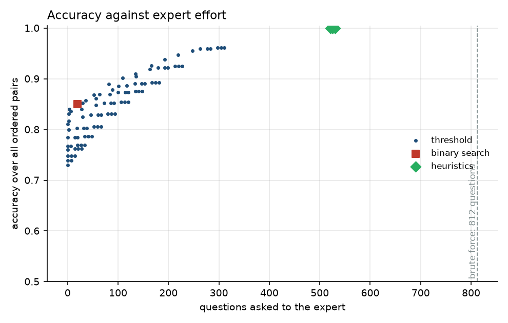
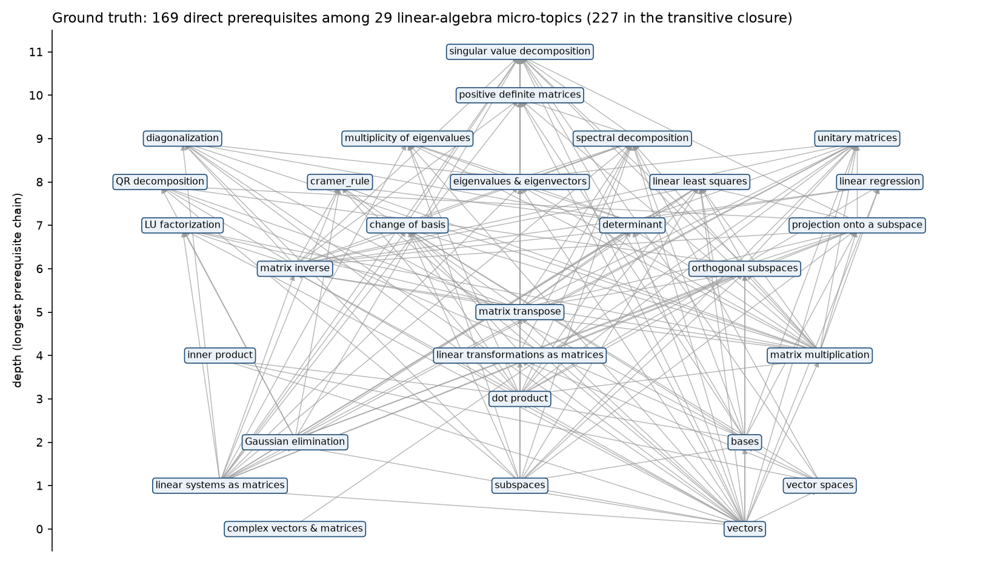
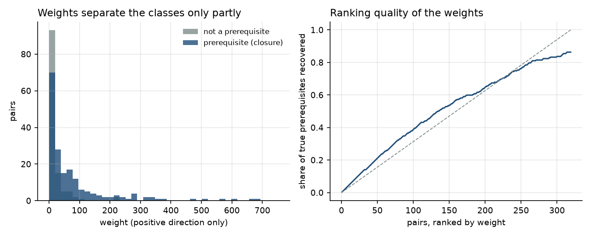

# prereq

[](https://github.com/specialone0007/labelMicroTopicRelationships/actions/workflows/ci.yml)


**How many questions does an expert have to answer to label every prerequisite relationship
among a set of micro-topics?** For 29 topics there are 812 ordered pairs. This package
simulates the expert, runs six query strategies against a ground-truth prerequisite graph and
model-produced pair weights, and reports accuracy against the number of questions each strategy
needed.

Sabancı University graduation project (ENS 491/492, 2019–2020) with Barış Baştürk, Kerem
Akıllıoğlu and Tugay Garib, supervised by Prof. Yücel Saygın, as one component of a
personalised e-learning platform. Rewritten in 2026 as a tested package; the original scripts,
final report and presentation are kept in [`legacy/`](legacy/) and [`docs/legacy/`](docs/legacy/).



## The problem

A prerequisite graph tells a learner what to study first. Building one by hand means asking an
expert "is A a prerequisite of B?" for every pair, which grows quadratically with the number of
topics. Two things can cut the effort:

- **Logic.** Prerequisites are transitive and antisymmetric. If the expert has said A → B and
  B → C, then A → C and C → A need no question.
- **A model.** A weight for every pair ("how likely is A → B?") from an upstream text-similarity
  model lets us accept confident pairs, reject unlikely ones, and ask only about the middle.

## Data

`data/linear-algebra/`: 29 micro-topics (vectors … singular value decomposition), a 29 × 29
antisymmetric weight matrix from the project's active-learning model, and the expert's list of
direct prerequisites. The list contains one pair given in both directions (determinant ↔
Gaussian elimination); the loader reports it and excludes both directions, leaving 169 direct
edges and 227 in the transitive closure.



## Strategies

| strategy | idea | questions | accuracy |
|---|---|---:|---:|
| `brute_force` | ask every ordered pair | 812 | 1.000 |
| `heuristic_random` | random unordered pairs; skip pairs implied by what is already known; a "yes" to A → B settles B → A | 530 ± 15 | 1.000 |
| `heuristic_by_topic` | same, but finish one random topic's pairs before moving on | 521 ± 28 | 1.000 |
| `heuristic_ordered` | same, topics taken from most advanced to most basic (weighted in-degree) | 525 | 1.000 |
| `threshold` (lower 0, upper 300) | accept weight > upper, reject < lower, ask the band between | 297 | 0.962 |
| `threshold` (lower 5, upper 30) | | 109 | 0.902 |
| `threshold` (lower 20, upper 30) | | 30 | 0.852 |
| `binary_search` | rank positive-weight pairs; binary-search the cut-off with three-vote probes | 20 | 0.850 |

Heuristic figures are mean ± s.d. over 100 seeds; the full threshold grid (91 settings) is in
[`results/benchmark.csv`](results/benchmark.csv). Accuracy is over all 812 ordered pairs against
the transitive closure of the expert's graph; the expert answers from that closure too. Scoring
against direct edges only is available with `--direct`.

What the numbers say:

- **Logic alone saves about a third.** The three implication heuristics recover the exact graph
  with 520–530 questions instead of 812. Ordering topics from advanced to basic makes the count
  deterministic but not smaller; on this graph the saving comes from transitivity, not from the
  order.
- **Weights buy a lot of accuracy cheaply, then plateau.** Twenty questions give 85 %, a hundred
  give 90 %, three hundred give 96 %. The last four points cost as much as the first thirty-five.
- **The weights rank pairs only slightly better than chance** (right panel below), which is why
  no threshold reaches 100 % and why the lower threshold matters more than the upper one: most
  true prerequisites have small positive weights, so raising the floor discards them.



## Run it

```bash
pip install -e ".[dev]"
pytest                                        # 15 tests, < 1 s
prereq info                                   # dataset summary
prereq run heuristic_ordered                  # one strategy against the simulated expert
prereq run threshold --lower 5 --upper 30
prereq run binary_search --direct             # score against direct edges instead of the closure
prereq bench --seeds 100                      # all strategies + threshold grid; results/ and docs/figures/
prereq ask heuristic_ordered                  # you are the expert: answers y/n in the terminal
```

```python
from prereq import load_dataset, run, repeat

ds = load_dataset("linear-algebra")
run(ds, "threshold", lower=5, upper=30)       # Outcome(questions=109, accuracy=0.902, ...)
repeat(ds, "heuristic_random", seeds=100)     # (530.0, 15.1, 1.0)
```

## Layout

```
src/prereq/
  data.py         Dataset: topics, weights, direct graph, closure; parsers with validation
  oracle.py       the simulated expert; counts distinct questions
  strategies.py   brute_force, three implication heuristics, threshold, binary_search
  evaluate.py     run() -> Outcome(questions, accuracy, precision, recall); repeat() over seeds
  plots.py        accuracy-vs-questions, weight diagnostics, layered ground-truth graph
  cli.py          prereq info | run | ask | bench
tests/            15 tests: parsing, closure, oracle accounting, every strategy on a toy chain,
                  exactness of the heuristics, threshold and binary-search bounds
data/             the linear-algebra set
results/          benchmark.csv
docs/figures/     the three figures above
docs/legacy/      2020 final report and presentation
legacy/           2020 scripts (Term I and Term II), unchanged
```

## Latest improvements (2026 rewrite)

- **One oracle, one accounting.** Every strategy asks the same `Oracle`, which counts distinct
  questions; results across strategies are directly comparable.
- **Implication as a first-class step.** The heuristics keep a DAG of answers and return its
  transitive closure, so implied pairs are both skipped and reported.
- **Ground truth as a graph, not a CSV.** Direct edges are parsed from the expert's list with
  validation (unknown topics, mutual pairs, cycles), and the closure is computed rather than
  hand-maintained.
- **A reproducible benchmark**: a threshold grid, 100-seed heuristic runs and a Pareto plot from
  one command, where the 2020 study read individual settings by hand.
- **Interactive mode kept**: `prereq ask` puts a human in the oracle's seat, as the 2020 Flask
  tool did.

## Reference

C. Liang, J. Ye, S. Wang, B. Pursel, C. L. Giles. *Investigating Active Learning for Concept
Prerequisite Learning.* AAAI 2018.

## License

MIT. 2020 project by Barış Baştürk, Furkan Reha Tutaş, Kerem Akıllıoğlu and Tugay Garib
(Sabancı University); 2026 rewrite by Furkan Reha Tutaş.
